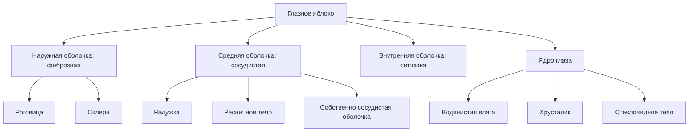
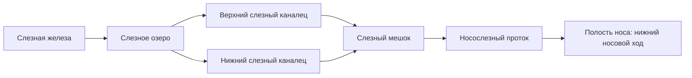
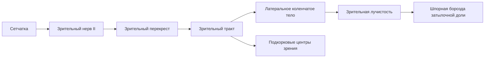
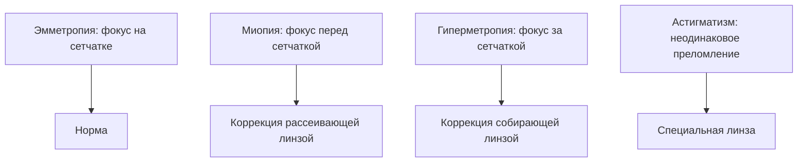
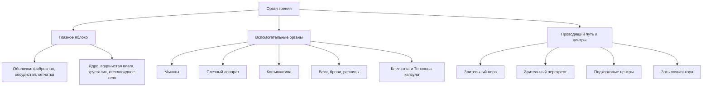

---

## 1. Значение органа зрения

Орган зрения обеспечивает:

- восприятие света, цвета и пространства;
    
- поступление к нервным центрам до 90% информации об окружающем мире;
    
- объемное зрительное восприятие, потому что орган зрения парный и подвижный.
    

### Состав органа зрения

- глазное яблоко;
    
- вспомогательные органы глазного яблока.
    

### Зрительный анализатор включает

- глазное яблоко;
    
- вспомогательные органы;
    
- проводящий зрительный путь;
    
- подкорковые и корковые центры зрения.
    

---

## 2. Глазное яблоко

**Глазное яблоко (bulbus oculi)** имеет форму шара с небольшой передней выпуклостью, соответствующей роговице.

### Оболочки глазного яблока

|Оболочка|Латинское название|Основные части|Функции|
|---|---|---|---|
|Наружная|tunica fibrosa|роговица, склера|формообразующая, защитная|
|Средняя|tunica vasculosa|радужка, ресничное тело, собственно сосудистая оболочка|питание, аккомодация, регуляция света|
|Внутренняя|retina|сетчатка|восприятие света и формирование нервного импульса|

### Схема строения

---

## 3. Фиброзная оболочка

Фиброзная оболочка выполняет:

- каркасную (формообразующую) функцию;
    
- защитную функцию.
    

### 3.1. Роговица

**Роговица (cornea)**:

- занимает 1/6 поверхности глазного яблока;
    
- имеет толщину около 1 мм;
    
- форма — как часовое стекло;
    
- выпуклость направлена кпереди.
    

#### Основные свойства роговицы

- прозрачность;
    
- равномерная сферичность;
    
- высокая чувствительность;
    
- высокая преломляющая способность — 42 диоптрии.
    

#### Функции роговицы

- защитная;
    
- оптическая.
    

#### Защитная функция

- механическая защита структур глазного яблока;
    
- формирование роговичного рефлекса:
    
    - мигание;
        
    - и/или выделение слезы при попадании пыли и других инородных частиц.
        

#### Оптическая функция

- прохождение света;
    
- преломление световых лучей.
    

#### Частые поражения роговицы

|Поражение|Причины|Суть|Коррекция/особенности|
|---|---|---|---|
|Помутнение роговицы (бельмо)|химические вещества, тяжелые ожоги, травмы, нарушения питания|потеря прозрачности|зависит от причины, может резко снижать зрение|
|Астигматизм|врожденная или приобретенная неравномерная и неправильная сферичность роговицы; травмы, заболевания|неодинаковое преломление света в вертикальной и горизонтальной плоскостях, искаженное изображение на сетчатке|специальные очки или линзы по степени изменения кривизны|

### 3.2. Склера

**Склера (sclera)**:

- состоит из плотной соединительной ткани;
    
- почти лишена сосудов и нервных окончаний;
    
- придает глазному яблоку форму;
    
- служит местом прикрепления мышц глазного яблока.
    

---

## 4. Сосудистая оболочка

Сосудистая оболочка (tunica vasculosa) прилежит к внутренней поверхности склеры.

### Части сосудистой оболочки

1. Радужка (iris)
    
2. Ресничное тело (corpus ciliare)
    
3. Собственно сосудистая оболочка (choroidea)
    

### 4.1. Радужка

**Радужка**:

- передняя часть сосудистой оболочки;
    
- расположена во фронтальной плоскости;
    
- видна через роговицу как диск с отверстием в центре.
    

#### Зрачок

- центральное отверстие радужки;
    
- его диаметр меняется за счет мышц радужки:
    
    - суживающая мышца;
        
    - расширяющая мышца.
        

#### Реакция зрачка на свет

|Освещенность|Размер зрачка|
|---|---|
|Сильная|узкий|
|Слабая|широкий|

#### Что содержит радужка

- мышцы;
    
- сосуды;
    
- большое количество пигмента, определяющего цвет глаз.
    

#### Функция

- диафрагма глаза, регулирующая количество света, попадающего на сетчатку.
    

### 4.2. Ресничное тело

**Ресничное тело (corpus ciliare)** — утолщенная часть сосудистой оболочки позади радужки.

#### Строение

- ресничные отростки;
    
- ресничный кружок;
    
- в толще — ресничная мышца.
    

#### Функции

- ресничные отростки вырабатывают водянистую влагу;
    
- ресничная мышца натягивает и расслабляет ресничный поясок (Циннову связку), окружающий хрусталик;
    
- обеспечивает аккомодацию — изменение кривизны хрусталика;
    
- это нужно для фокусировки при взгляде вблизь и вдаль.
    

### 4.3. Собственно сосудистая оболочка

**Choroidea** представлена сплетениями артерий и вен, расположенными в рыхлой соединительной ткани.

---

## 5. Сетчатка

Сетчатка (retina) — внутренняя чувствительная оболочка, плотно прилегающая к сосудистой оболочке.

### Состав сетчатки

- палочки;
    
- колбочки;
    
- нервные клетки;
    
- пигментные клетки.
    

### Фоторецепторы

|Элемент|Расположение|Функция|
|---|---|---|
|Палочки|почти вся сетчатка, кроме слепого пятна|черно-белое (ночное) зрение|
|Колбочки|преимущественно желтое пятно|дневное (цветовое) зрение|

### Важные участки сетчатки

- Слепое пятно — место выхода зрительного нерва (диск зрительного нерва), здесь палочек нет.
    
- Желтое пятно — зона наибольшего скопления колбочек.
    

### Как формируется зрительный импульс

1. Раздражаются палочки и колбочки.
    
2. Возникают нервные импульсы.
    
3. Они передаются на нервные клетки сетчатки.
    
4. Отростки этих клеток формируют зрительный нерв.
    
5. Импульсы идут в подкорковые центры зрения.
    
6. Далее — в корковый центр зрения.
    

---

## 6. Содержимое глазного яблока (ядро)

К ядру глазного яблока относятся:

- водянистая влага;
    
- хрусталик;
    
- стекловидное тело.
    

### Их общие функции

- светопроводящая;
    
- светопреломляющая.
    

|Структура|Функция|Особенности|
|---|---|---|
|Водянистая влага|проводит свет, питает роговицу и хрусталик|заполняет переднюю и заднюю камеры; вырабатывается ресничным телом|
|Хрусталик|аккомодация, преломление света|преломляющая сила около 20 диоптрий|
|Стекловидное тело|проведение света к сетчатке|оптическая среда глаза|

### 6.1. Водянистая влага

**Водянистая влага (humor aquosus)**:

- вырабатывается ресничным телом;
    
- заполняет переднюю и заднюю камеры глаза;
    
- обеспечивает прохождение света;
    
- питает роговицу и хрусталик.
    

#### Патология

**Глаукома** возникает при нарушении оттока водянистой влаги.

- результат: повышение внутриглазного давления;
    
- при несвоевременном лечении может привести к слепоте.
    

### 6.2. Хрусталик

**Хрусталик (lens)**:

- обеспечивает аккомодацию глазного яблока;
    
- преломляет световые лучи силой около 20 диоптрий.
    

### 6.3. Стекловидное тело

**Стекловидное тело**:

- оптическая среда;
    
- проводит свет к сетчатке.
    

---

## 7. Вспомогательные органы глазного яблока

К ним относятся:

- мышцы;
    
- слезный аппарат;
    
- оболочки и клетчатка глазничного органокомплекса;
    
- конъюнктива;
    
- брови;
    
- веки;
    
- ресницы.
    

---

## 8. Мышцы глазного яблока

Мышцы обеспечивают подвижность глазного яблока.

### 8.1. Виды мышц

- 4 прямые:
    
    - верхняя;
        
    - нижняя;
        
    - латеральная;
        
    - медиальная.
        
- 2 косые:
    
    - верхняя;
        
    - нижняя.
        

### 8.2. Движения

|Мышца|Действие|
|---|---|
|Прямые мышцы|двигают глазное яблоко в свою сторону|
|Верхняя косая|вращает глазное яблоко вниз и латерально|
|Нижняя косая|вращает глазное яблоко вверх и латерально|

---

## 9. Слезный аппарат

Слезный аппарат состоит из:

- слезной железы;
    
- слезных путей.
    

### 9.1. Слезная железа

- расположена в верхнелатеральном углу глазницы;
    
- выделяет слезу, богатую лизоцимом;
    
- лизоцим обеспечивает бактерицидную функцию.
    

### Функции слезы

- смачивает роговицу;
    
- препятствует ее воспалению;
    
- удаляет частицы пыли;
    
- участвует в питании роговицы.
    

### 9.2. Путь оттока слезы

#### Последовательность оттока

1. Слезное озеро — расширение в медиальном углу глаза.
    
2. Затем слеза идет по слезным канальцам.
    
3. Далее поступает в слезный мешок.
    
4. Потом по носослезному протоку.
    
5. Выводится в нижний носовой ход.
    

---

## 10. Оболочки и клетчатка глазничного органокомплекса

Включают:

- надкостницу глазницы;
    
- Тенонову капсулу;
    
- жировое тело глазницы.
    

### 10.1. Тенонова капсула

- окружает глазное яблоко как футляр;
    
- рыхло связана со склерой;
    
- сзади переходит во влагалище зрительного нерва;
    
- между глазным яблоком и капсулой находится теноново (эписклеральное) пространство.
    

### Значение тенонова пространства

- обеспечивает свободные движения глазного яблока.
    

### Через Тенонову капсулу проходят

- зрительный нерв;
    
- мышцы глазного яблока;
    
- сосуды;
    
- нервы.
    

### 10.2. Жировое тело

- расположено преимущественно у заднего полюса глазного яблока.
    

---

## 11. Конъюнктива

**Конъюнктива** — разновидность слизистой оболочки, покрывающая:

- заднюю поверхность верхнего века;
    
- заднюю поверхность нижнего века;
    
- переднюю поверхность глазного яблока.
    

⚠️ Роговицу конъюнктива не покрывает.

---

## 12. Веки

**Веки** — структуры, частично или полностью прикрывающие глазное яблоко спереди.

### Строение век

- кожа;
    
- вековая часть круговой мышцы глаза;
    
- плотная соединительнотканная пластинка — хрящ века;
    
- конъюнктива, покрывающая внутреннюю поверхность век и переднюю часть склеры.
    

### Функции век

- защитная;
    
- равномерное распределение слезной жидкости.
    

### Патология

- воспаление век — блефарит.
    

---

## 13. Брови и ресницы

**Брови и ресницы** — короткие щетинковые волосы.

### Функции

- ресницы при мигании задерживают крупные частицы пыли;
    
- брови отводят пот латерально и медиально от глазного яблока;
    
- также выполняют косметическую функцию.
    

---

## 14. Проводящий путь и нервные центры зрительного анализатора

### 14.1. Путь импульса

По волокнам зрительного нерва (II пара черепных нервов) импульсы идут к зрительному перекресту.

### Что происходит в перекресте

- информация от латеральных частей сетчатки не перекрещивается и идет в зрительный тракт;
    
- информация от медиальных частей сетчатки перекрещивается.
    

### 14.2. Подкорковые центры зрения

Расположены в среднем и промежуточном мозге.

|Центр|Локализация|Функция|
|---|---|---|
|Верхние холмики|средний мозг|ответная реакция на неожиданные зрительные раздражители|
|Задние ядра таламуса|промежуточный мозг|бессознательная оценка зрительной информации|
|Латеральные коленчатые тела|промежуточный мозг|передача информации к коре через зрительную лучистость|

### 14.3. Корковый центр зрения

- расположен в шпорной борозде затылочной доли;
    
- обеспечивает сознательную оценку зрительной информации.
    

### Схема зрительного пути

---

## 15. Фокусировка изображения и нарушения рефракции

### 15.1. Норма зрения

В норме изображение фокусируется:

- на сетчатке;
    
- в области желтого пятна;
    
- в перевернутом виде.
    

Кора головного мозга дополнительно «поворачивает» образ, поэтому человек видит предметы в реальном виде.

### 15.2. Эмметропия

**Эмметропия** — нормальное зрение.

### 15.3. Миопия

**Миопия (близорукость)**:

- изображение проецируется перед сетчаткой;
    
- коррекция — рассеивающая линза.
    

### 15.4. Гиперметропия

**Гиперметропия (дальнозоркость)**:

- хорошо видны далеко расположенные предметы;
    
- изображение фокусируется за сетчаткой;
    
- коррекция — собирающая линза.
    

### 15.5. Астигматизм

- изображение искажается из-за неравномерной кривизны роговицы;
    
- коррекция — специальная линза.
    

### Схема хода лучей

---

## 16. Краткая итоговая таблица по нарушениям

|Нарушение|Причина/механизм|Что происходит|Коррекция|
|---|---|---|---|
|Бельмо|помутнение роговицы|снижение прозрачности|зависит от причины|
|Астигматизм|неправильная сферичность роговицы|искаженное изображение|специальные очки/линзы|
|Глаукома|нарушение оттока водянистой влаги|повышается внутриглазное давление|срочное лечение|
|Миопия|чрезмерная преломляющая сила / фокус перед сетчаткой|плохо видно вдаль|рассеивающая линза|
|Гиперметропия|недостаточная преломляющая сила / фокус за сетчаткой|хуже видно вблизи|собирающая линза|

---

## 17. Сверхкраткая схема всего раздела

---

> [!important] Главное запомнить
> 
> - Роговица — главная светопреломляющая и защитная структура переднего отдела.
>     
> - Радужка регулирует количество света через зрачок.
>     
> - Сетчатка содержит палочки и колбочки.
>     
> - Водянистая влага питает роговицу и хрусталик; ее отток важен для профилактики глаукомы.
>     
> - Хрусталик отвечает за аккомодацию.
>     
> - Зрительный анализатор включает не только глаз, но и проводящий путь, подкорковые и корковые центры.
>